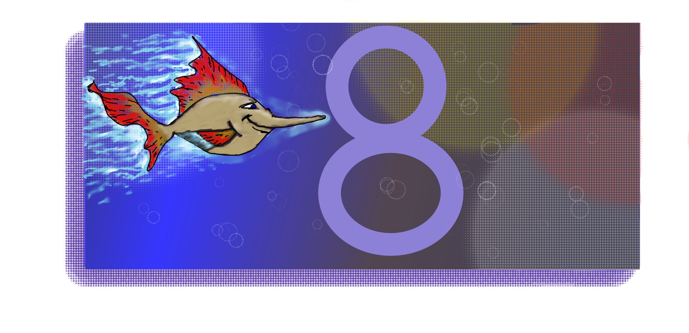
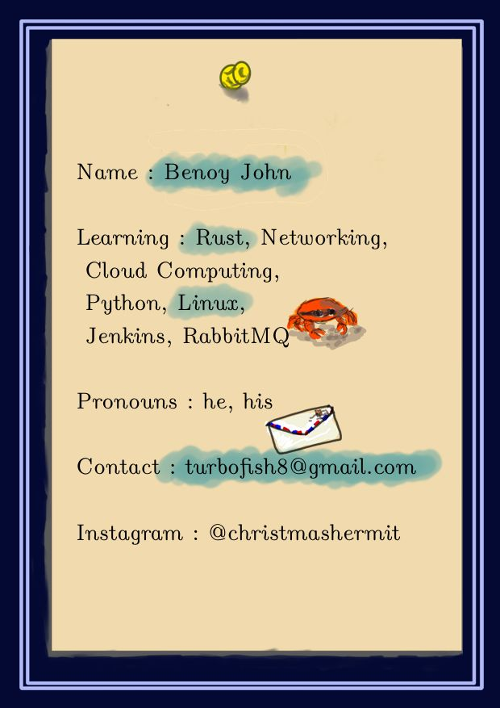

Hello! 

My name is **Benoy John**.
 
 
 

I am trying to learn **Rust** programming language along with networking and cloud computing.

I will also try to learn more of Python, Jenkins, RabbitMQ and Linux on the side.

You can reach me at turbofish8@gmail.com
 
 
Fun facts: 
* I am an absolute novice at DnD and lead a group of some more novices as their DM. We have started of with the basic 5e edition and have literally no idea what we are doing.
* I attempt to learn ukulele, guitar and tin whistle when I can.

 
**Thank you for visiting!!** :wave:

 
 
 
 
 
Here's the summarized version :

